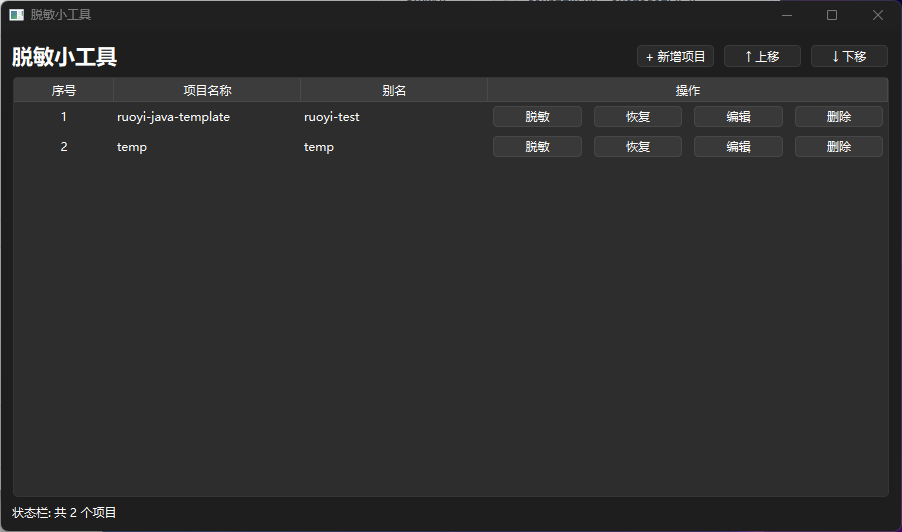
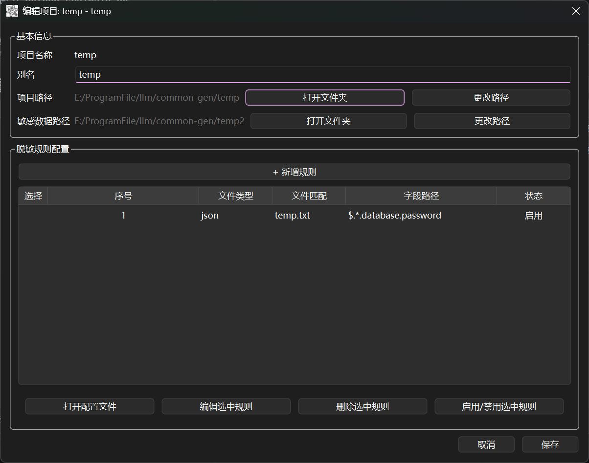
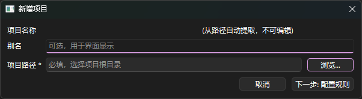

# 脱敏小工具 (Quick Desensitization Tool)

一款桌面应用程序，用于对项目配置文件中的敏感数据进行脱敏处理，让你在使用 AI 编程助手时无需担心隐私泄露。

## 简介

随着 AI 编程助手的普及，开发者们越来越多地依赖 AI 来帮助调试、重构或增强代码。然而，项目的配置文件中通常包含大量敏感信息，例如：

- 数据库密码和连接字符串
- API 密钥和访问令牌
- 私钥和证书
- 服务凭证
- 云平台密钥

**脱敏小工具** 可以帮你解决这个烦恼：

1. **脱敏** 项目 — 将敏感值替换为安全的占位符
2. **安全分享** — 将脱敏后的项目放心交给 AI 工具
3. **一键还原** — 需要时恢复所有原始敏感值

## 功能特点

- **多格式支持**：支持 YAML、ENV、JSON 配置文件
- **灵活规则**：支持通配符 `*` 和 `**` 配置脱敏字段
- **安全存储**：原始值单独存储，采用 Base64 编码
- **自动备份**：修改文件前自动创建备份
- **项目管理**：支持多项目独立配置
- **一键还原**：点击按钮即可恢复所有原始值
- **图形界面**：简洁易用的桌面应用程序（中文界面）
- **即开即用**：提供打包好的 EXE 文件，双击即可运行
- **批量操作**：支持多选规则进行批量删除、启用/禁用
- **导入导出**：支持导入导出脱敏规则，方便规则复用
- **MCP 集成**：支持 MCP（Model Context Protocol），可与 AI 编程助手深度集成
- **独立模式**：支持 `--mcp` 参数以无界面模式运行 MCP 服务

## 安装使用

### 快速开始（推荐）

如果你只想运行程序，无需安装 Python 或依赖：

```bash
# 下载最新的 release 版本，双击 .exe 文件即可运行
```

无需任何安装步骤。

### 源码运行

如果你想从源码运行或参与开发：

#### 环境要求

- Python 3.8+
- pip

#### 安装步骤

```bash
# 克隆或进入项目目录
cd quick_desensitization

# 安装依赖
pip install -r requirements.txt
```

#### 运行程序

```bash
python src/main.py
```

或者在 Windows 上双击 `run.bat`。

## 使用教程

### 1. 添加新项目

点击 **+ 新增项目**，配置以下信息：

- **项目路径**：选择你的项目根目录
- **别名**：项目的唯一标识符，用于 MCP 调用
- **敏感数据路径**：自动生成到配置目录中 `{别名}_{创建时间戳}`，建好后可在编辑中自行修改



### 2. 配置脱敏规则

点击项目上的 **编辑**，然后点击 **+ 新增规则** 添加规则：



| 文件类型 | 说明 | 示例字段路径 |
|---------|------|------------|
| `yml` | YAML 配置文件 | `spring.datasource.password` |
| `env` | 环境变量文件 | `DB_PASSWORD` |
| `json` | JSON 配置文件 | `$.database.password` |



#### 字段路径示例

**YAML：**
```
spring.datasource.password          # 精确匹配
spring.datasource.*.password        # 匹配一级
spring.datasource.**.password       # 递归匹配任意层级
```

**ENV：**
```
DB_PASSWORD                         # 精确匹配
DB_*                                # 匹配所有以 DB_ 开头
*_PASSWORD                          # 匹配所有以 _PASSWORD 结尾
```

**JSON (JSONPath)：**
```
$.database.password                 # 精确路径
$..password                         # 递归匹配（任意位置）
$.database.*.password               # 通配符匹配
```

#### 批量操作与导入导出

在规则列表中，支持以下多选操作：

- **Ctrl + 点击**：选择多条不连续的规则
- **Shift + 点击**：选择范围内多条规则
- **Ctrl + A**：全选

选中规则后，可进行批量删除、启用/禁用操作。

点击 **导入规则** 可从 CSV 文件导入规则（重复规则会自动跳过）。点击 **导出选中规则** 可将选中的规则导出为 CSV 文件。

### 3. 执行脱敏

点击项目上的 **脱敏**：

1. 扫描项目中所有匹配的文件
2. 将敏感值替换为 `${val_abc123}` 格式的占位符
3. 将原始值存储到敏感数据目录
4. 自动创建备份

### 4. 分享给 AI

项目现已安全！占位符对外部没有任何实际意义。

### 5. 还原数据

收到 AI 的帮助后，需要恢复原始值时：

1. 点击项目上的 **恢复**
2. 所有原始值将从敏感数据存储中恢复
3. **重要**：调试完成后，请再次点击 **脱敏** 保护你的数据！

### 6. MCP 集成

本工具支持 MCP（Model Context Protocol），可与 AI 编程助手（如 Cursor、Windsurf、Trae 等）深度集成使用。

#### MCP 工具一览

| 工具 | 说明 |
|------|------|
| `list_projects` | 列出所有已配置的脱敏项目 |
| `get_project_rules` | 获取指定项目的脱敏规则列表（含 ID） |
| `add_project_rule` | 为项目添加一条脱敏规则 |
| `edit_project_rule` | 按 ID 编辑某条脱敏规则 |
| `delete_project_rule` | 按 ID 删除某条脱敏规则 |
| `toggle_project_rule` | 按 ID 启用/禁用某条脱敏规则 |
| `add_project` | 新增脱敏项目（自动生成敏感数据路径） |
| `desensitize` | 对项目执行脱敏操作 |
| `restore` | 对项目执行数据还原 |

> ⚠️ **重要提醒**：强烈建议不要通过 MCP 来添加项目（`add_project`），而是在 UI 界面中手动操作。通过 MCP 新增项目会导致项目路径暴露给大模型，大模型可能据此读取你项目中的敏感文件。请使用 UI 安全地创建项目，让大模型仅通过 MCP 对已配好的项目执行脱敏/恢复/规则管理等操作。

#### 获取 MCP 配置

点击工具栏上的 **📋 MCP配置** 按钮，配置文件会自动复制到剪贴板，然后粘贴到 AI 编辑器的 MCP 配置中使用。

> 注意：工具会自动检测当前是源码模式还是打包后的 exe 模式，生成对应的配置内容。

#### 源码模式 MCP 配置示例

```json
{
  "mcpServers": {
    "desensitization-tool": {
      "command": "python",
      "args": ["-u", "main.py"],
      "cwd": "E:\\...\\quick_desensitization\\src"
    }
  }
}
```

#### 独立模式运行（打包为 exe 后）

打包为 exe 后，可使用 `--mcp` 参数以无界面方式运行 MCP 服务：

```json
{
  "mcpServers": {
    "desensitization-tool": {
      "command": "E:\\...\\MultiMask.exe",
      "args": ["--mcp"]
    }
  }
}
```

#### AI 调用示例

```
帮我对 "my-project" 这个项目执行脱敏操作
列出所有项目
给 "ruoyi-test" 项目添加一条规则，文件类型为 yml，匹配 application*.yml，字段路径为 spring.datasource.password
```

## 项目结构

```
quick_desensitization/
├── src/
│   ├── main.py                 # 程序入口
│   ├── desensitize_engine.py   # 核心脱敏逻辑
│   ├── storage.py              # 数据持久化层
│   └── ui/
│       └── main_window.py      # GUI 组件
├── requirements.txt        # Python 依赖
└── run.bat                 # Windows 启动脚本
```

## 工作原理

### 脱敏流程

```
原始值:      my_secret_password
       ↓
占位符:      ${val_a1b2c3d4e5f6}
       ↓
存储位置:    secret.csv (敏感数据目录，Base64 编码)
```

### 安全设计

- **分离原则**：敏感数据目录必须在项目目录外
- **编码存储**：原始值使用 Base64 编码存储
- **自动备份**：修改前自动备份原文件
- **纯本地处理**：所有操作均在本地完成，无网络传输

## 配置文件说明

### secret_config.csv

位于敏感数据目录中，定义脱敏规则：

```csv
yml,application*.yml,spring.datasource.password,true
env,.env,DB_PASSWORD,true
json,config.json,$.api.key,true
```

### secret.csv

位于敏感数据目录中，存储原始敏感值（Base64 编码）：

```csv
# 敏感信息存储文件
# 格式: 文件路径,字段路径,占位符,原始值(Base64),脱敏时间
```

## 技术依赖

- **PySide6**: Qt for Python（GUI 框架）
- **PyYAML**: YAML 解析
- **ruamel.yaml**: YAML 处理（保留引号格式）

## 适用场景

### 场景一：AI 代码审查

1. 你有一个包含数据库凭证的 Spring Boot 项目
2. 分享给 AI 代码审查者之前，先点击 **脱敏**
3. 安全分享脱敏后的项目
4. 收到审查建议后，点击 **恢复** 还原凭证

### 场景二：AI 调试

1. 你的微服务在 `.env` 文件中包含 API 密钥
2. 将代码交给 AI 前，先执行 **脱敏**
3. 获取 AI 的调试帮助
4. 点击 **恢复** 还原工作配置

### 场景三：AI 重构

1. 项目包含加密的数据库密码在 YAML 中
2. 使用 `**.password` 模式进行脱敏
3. 使用 AI 重构配置管理
4. 验证改动后还原原始密码

## 开源协议

MIT License

## 免责声明

本工具按原样提供。在与任何外部服务共享敏感数据之前，请始终确保你的数据已得到适当保护。因使用不当造成的数据泄露，开发人员不承担任何责任。
